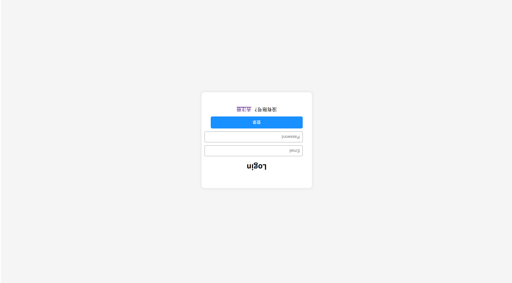
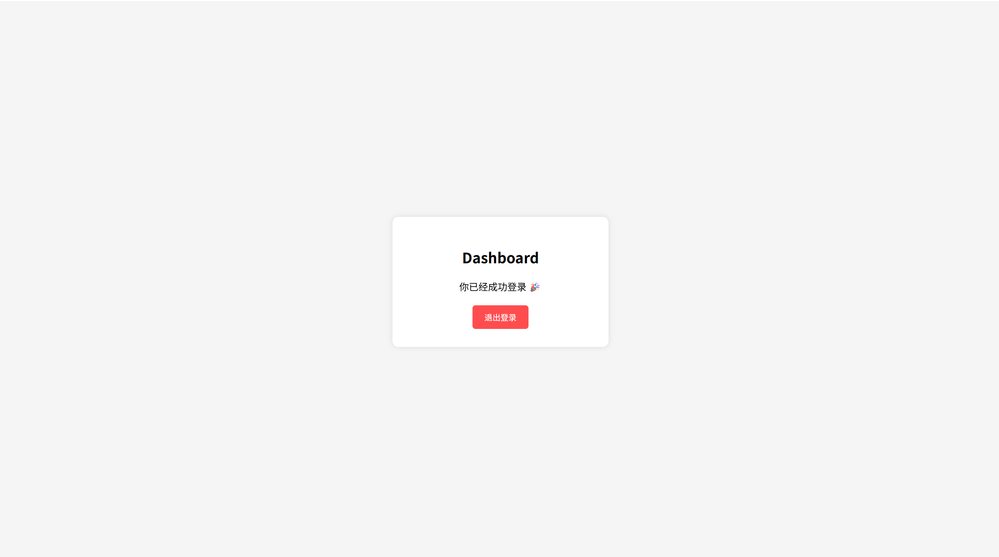

# Auth Fullstack System

> 一个基于 React + Node.js + MongoDB Atlas 的全栈登录鉴权系统，实现完整用户认证流程（注册 / 登录 / JWT / 路由保护）

---

## 项目简介

本项目实现了一个完整的用户认证系统，覆盖：

- 前端表单交互  
- 后端鉴权逻辑  
- 数据库存储  
- 前端权限控制  

核心目标： 
**登录鉴权流程 + 前后端联调 + 工程结构设计**

---

## 项目截图

| Login | Dashboard |
|------|----------|
|  |  |

---

## 技术亮点

- 基于 JWT 的无状态认证机制  
- 使用 bcrypt 实现密码加密存储  
- 前端路由守卫（Protected Route）  
- Axios 二次封装（请求拦截 + token 自动注入）  
- MongoDB Atlas 云数据库  
- 登录态持久化（localStorage）  
- 前后端分离架构  

---

## 技术栈

### 1. Frontend
- React (Hooks)
- React Router v6
- Axios

### 2. Backend
- Node.js
- Express
- MongoDB (Mongoose)
- JSON Web Token (JWT)
- bcryptjs

---

## 项目结构

```bash
auth-fullstack-system/
├── server/                # Backend
│   ├── server.js
│   └── .env
│
├── task-app/              # Frontend
│   ├── src/
│   │   ├── api/           # axios封装
│   │   ├── pages/         # 页面
│   │   ├── router/        # 路由
│   │   └── App.jsx
│   └── package.json
```

---

## 核心流程（面试重点）

| Step | Description |
|------|------------|
| 1 | 用户登录 |
| 2 | 前端发送请求 |
| 3 | 后端校验用户 + bcrypt比对 |
| 4 | 生成 JWT token |
| 5 | 返回 token 给前端 |
| 6 | 前端存入 localStorage |
| 7 | 后续请求携带 token |
| 8 | 后端验证 token 合法性 |

---

## 核心功能实现

### 1. 用户注册

- 前端输入 email + password  
- 后端使用 bcrypt.hash 加密  
- 存储到 MongoDB  

---

### 2. 用户登录

- 根据 email 查找用户  
- 使用 bcrypt.compare 校验密码  
- 使用 jwt.sign 生成 token  

```js
const token = jwt.sign(
  { userId: user._id },
  process.env.JWT_SECRET,
  { expiresIn: "7d" }
);
```

### 3️. 登录态管理

- 使用 localStorage 存储 JWT token  
- 页面刷新后仍保持登录状态  
- 结合路由守卫实现前端权限控制  

### 4️. Axios 封装

对请求进行统一管理：

- 配置 baseURL  
- 请求拦截器自动注入 token  
- 响应拦截器统一处理错误

 提高代码复用性与可维护性

```js
instance.interceptors.request.use(config => {
  const token = localStorage.getItem("token");
  if (token) {
    config.headers.Authorization = token;
  }
  return config;
});
```

### 5️. 路由守卫（Protected Route）

实现前端权限控制：

- 判断 localStorage 是否存在 token
- 无 token → 重定向到登录页  
- 有 token → 允许访问受保护页面  

## 本地运行指南

### 1️. 启动后端

```Bash
cd server
npm install
node server.js
```

### 2️. 启动前端

```Bash
cd task-app
npm install
npm run dev
```

## 环境变量配置

在 server/.env 中：

```env
MONGO_URI=your_mongodb_uri
JWT_SECRET=your_secret
```

## Author
**jackw531**